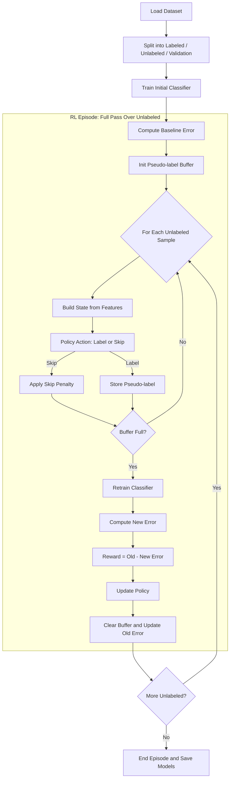

# Reinforcement Learning for Pseudo-Labeling

## Overview  

We have implemented a reinforcement learning framework for pseudo-labeling that learns to assign pseudo-labels to unlabeled data in a way that improves downstream classifier accuracy. 

**Core idea**:  
The RL agent decides which unlabeled samples should receive labels. The classifier retrains using these pseudo-labels. If validation error improves, the agent receives a positive reward.


https://github.com/user-attachments/assets/0857a3ed-9e58-468c-b43e-a56fbee27a23

---

## Method Summary

### 1. Data Loading & Splitting  
Dataset is divided into three sets:
- **Labeled set** – used to train the initial classifier  
- **Unlabeled set** – used by the RL agent for pseudo-labeling  
- **Validation set** – used to compute error and reward  

Splitting sizes are configured in `config.py`.

### 2. Initial Classifier Training  
The CNN classifier is trained on the labeled set.  
Validation accuracy is computed → error rate = `1 - accuracy`.  
This establishes the baseline used to compute rewards.

### 3. RL Episode (One Full Pass Over Unlabeled Data)  
For each unlabeled image:
1. Extract features, probability vector, and entropy  
2. Build a state vector  
3. RL agent chooses an action:  
   - **0–9** → assign that pseudo-label  
   - **10** → skip sample  
4. Pseudo-labels accumulate in a buffer  
5. Once the buffer reaches `batch_size`, classifier retrains  
6. New validation error is computed  
7. Reward = `old_error − new_error`  
8. Policy updates once using REINFORCE  
9. Buffer clears, next batch begins  

One full pass over the unlabeled dataset = one RL episode.

---

## Full Pipeline Diagram



NOTE: mermaid plugin needs to be installed to view on Pycharm / Visual Studio Code editor. Else, snip of similar one drawn in miro board can be refered at `presentation/FinalPresentation/RLPL/images/Flow_Diagram.png`

---

## Project Structure

```
capstone
├── demo/                                   # Presentation Recording
├── presentation/                   
│   ├── PreliminaryPresentation/            # MidTerm Presentation
│   │   ├── RLPL/                           # Reference code and images for .tex files
│   │   ├── main.tex                        # main presentation in .tex
│   │   └── PreliminaryPresentation.pdf     # presentation in pdf
│   └── FinalPresentation/                  # Final Presentation
│       ├── RLPL/                           # Reference code and images for .tex files
│       ├── main.tex                        # main presentation in .tex
│       └── FinalPresentation.pdf           # presentation in pdf
├── reports/                                # Final report in latex
├── research_paper/                         # Final research paper in latex
├── src/
│   ├── component/                          # Main project source code
│   │   ├── main.py                         # RL + classifier training loop
│   │   ├── env.py                          # Custom Gym environment
│   │   ├── model.py                        # downstream model + policy network
│   │   ├── utils.py                        # Data loading & preprocessing
│   │   ├── config.py                       # Hyperparameters
│   │   └── requirements.txt                # Python dependencies
│   ├── tests/
│   │   └── trained_models_<model_name>_<data_source>.zip  # Saved weights (zip)
│   └── Readme.md                           # Instructions for running code
├── .gitignore
└── Readme.md                               # Main project README (high-level)
```

---

### 4. Research Background

This approach is inspired by concepts from following research papers:

- [A review of Pseudo-Labeling For Computer Vision](https://arxiv.org/pdf/2408.07221)
- [RLGSSL (Reinforcement Learning for Graph-Based SSL)](https://arxiv.org/pdf/2405.01760)
- [Selective Pseudo-Labeling with Reinforcement Learning for Semi-Supervised Domain Adaptation](https://arxiv.org/pdf/2012.03438)